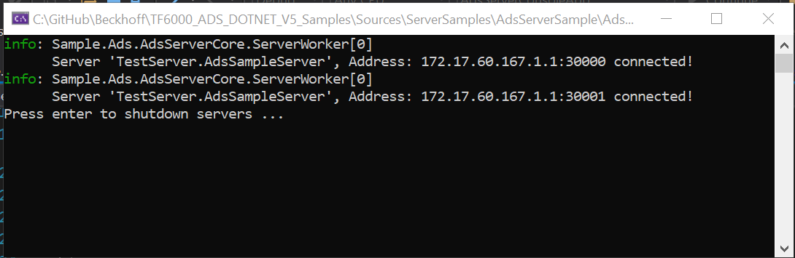
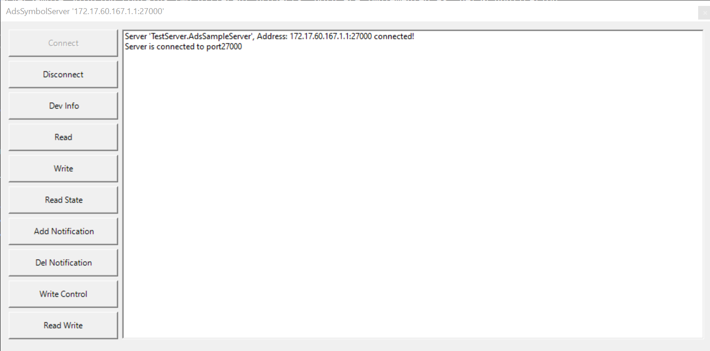

# Using of the AdsServerSample
The AdsServerSample Solution contains two different projects. Both are implemented as .net50 Application
## AdsServerConsoleApp
This is an simple Console Application that Implements two AdsServers side-by-side in one Console Application. The target framework is .NET5.0.
The console application starts two local AdsServers on Port 30000, and 30001. If started, an ADSClient can connect to theses ports (e.g. the **TcXaeMgmt** Powershell console as described below.)


```powershell
PS> test-adsroute -netId 172.17.60.167.1.1 -port 0x8000

Name                 Address           Port   Latency Result
                                               (ms)
----                 -------           ----   ------- ------
CX_1234              172.17.60.167.1.1 32768  25      Ok

PS> test-adsroute -netId 172.17.60.167.1.1 -port 0x8001

Name                 Address           Port   Latency Result
                                               (ms)
----                 -------           ----   ------- ------
CX_1234              172.17.60.167.1.1 32769  31      Ok
```

## AdsServerTester
A little GUI application (Windows Forms) including a server to teach the AdsServer behaviour. The target framework is .NET5.0-Windows.

The directory SampleServer contains Visual Studio projects with a sample implementation of an ADS server.

Open the solution file Test.AdsServerClr4.sln for the .NET 4 platform. The class AdsSampleServer implements a simple ADS server that is connected with a simple GUI.
Build and start the sample application.
The sample server can be controlled via the following GUI:



The first two buttons on the left control the connectivity of the server:

The Connect button connects the server to the fixed ADS port 27000. When the server is successfully connected, it is ready to answer ADS requests.
The Disconnect button disconnects the server an releases its ADS port.
The following buttons send ADS requests from the server. In this sample the server sends requests to itself. The requests are used to show how incoming responses can by handled in the overwritten confirmation methods of the server.

- Button Dev Info: Send an ADS Read Device Info Request.
- Button Read: Send an ADS Read Request.
- Button Write: Send an ADS Write Request.
- Button Read State: Send an ADS Read State Request.
- Button Add Notification: Send an ADS Add Device Notification Request
- Button Del Notification: Send an ADS Delete Device Notification Request
- Button Write Control: Send an ADS Write Control Request.
- Button Read Write: Send an ADS Read Write Request.

# Testing AdsServer(s)
For testing purposes of (headless) AdsServer applications, an ADS Client application is needed
to access the server.

Possible options are
- an AdsClient .NET application build from the  [Beckhoff.TwinCAT.Ads Package](https://www.nuget.org/packages/Beckhoff.TwinCAT.Ads/)
- the [**TcXaeMgmt** Powershell module](https://www.powershellgallery.com/packages/TcXaeMgmt) for easy scripting under Powershell.
- the ADS Monitor

Below, the access and test via **TcXaeMgmt** Module is shown.

## Installing the **TcXaeMgmt** Powershell Module (optional)
If the **TcXaeMgmt** Module is not already existing on the system, it 
can be installed from the (Powershell Gallery)[https://www.powershellgallery.com]:

To test the availability:
```powershell
get-module TcXaeMgmt -listAvailable
```

The module is available in different flavours to support
- Windows Powershell >= 4.0
- Powershell (Core) >= 6.0

and different TwinCAT (Tc2 and Tc3) versions.  
<br>[TcXaeMgmt Package](https://www.powershellgallery.com/packages/TcXaeMgmt)  
[Beckhoff Documentation](https://infosys.beckhoff.com/content/1033/tc3_ads_ps_tcxaemgmt/3972231819.html?id=8731138690123386389)</br>

Please check the installation hints and install the module via PowershellGet Package Manager:
```powershell
PS> install-module TcXaeMgmt
PS> get-module TcXaeMgmt -listAvailable
```
## Testing the custom Ads Server in **AdsServerConsoleApp**
### Testing the AdsServer
```powershell
test-adsroute -netId 172.17.60.167.1.1 -port 0x8000

Name                 Address           Port   Latency Result
                                               (ms)
----                 -------           ----   ------- ------
CX_1234              172.17.60.167.1.1 32768  18      Ok
```
### Getting AdsState
```powershell
 get-adsstate -netId 172.17.60.167.1.1 -port 0x8000

Name    State OK   Time (ms) Address
----    ----- --   --------- -------
CX_1234 Run   True 23        172.17.60.167.1.1:32768
```
